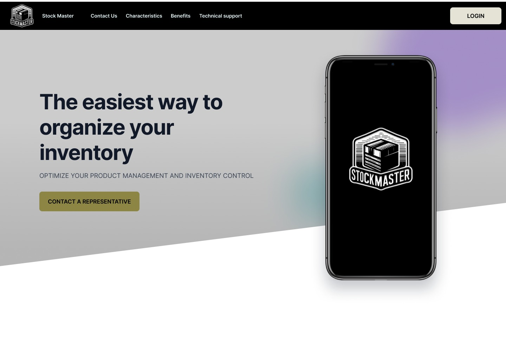
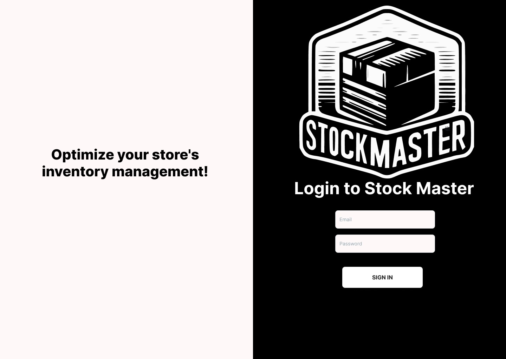
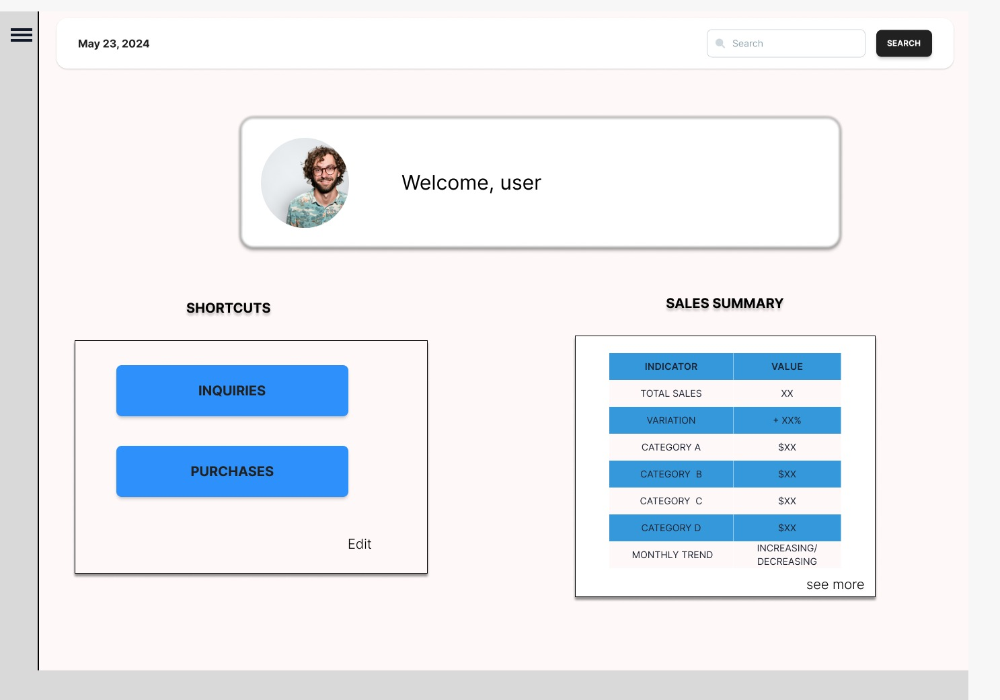
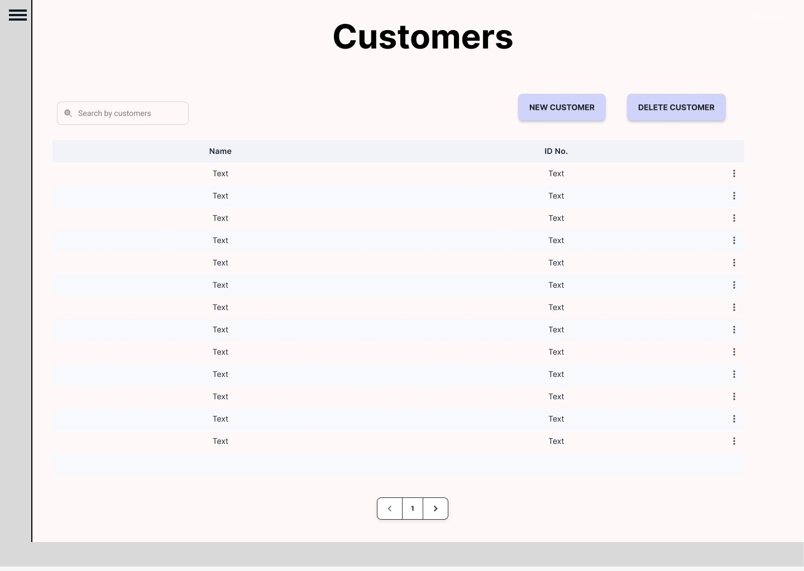
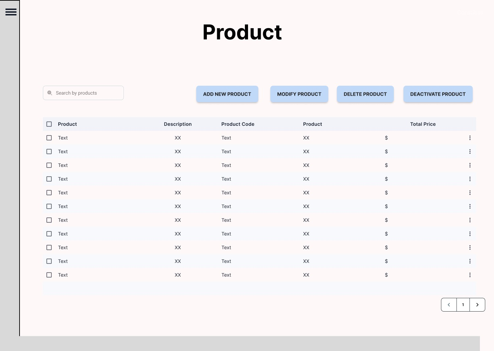
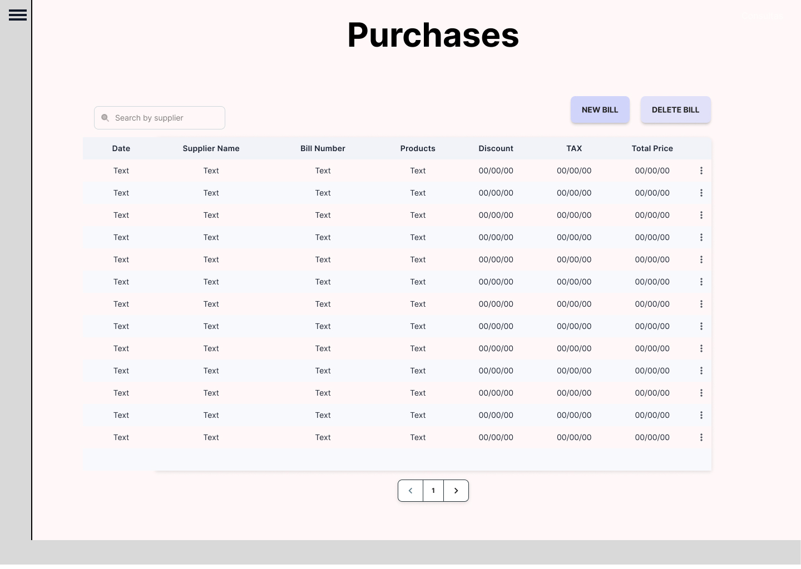
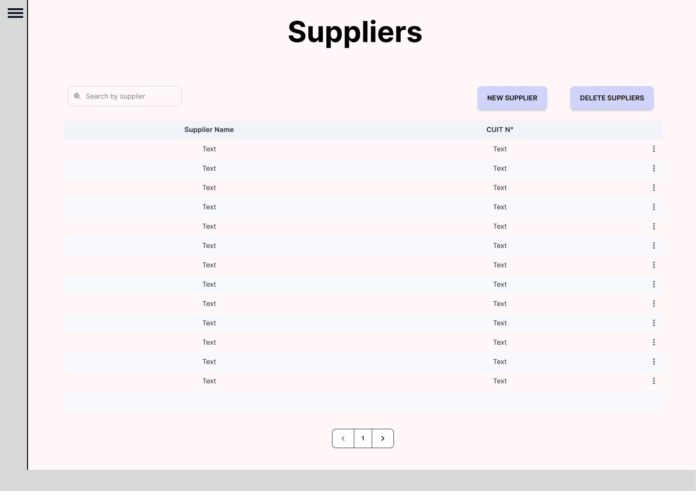
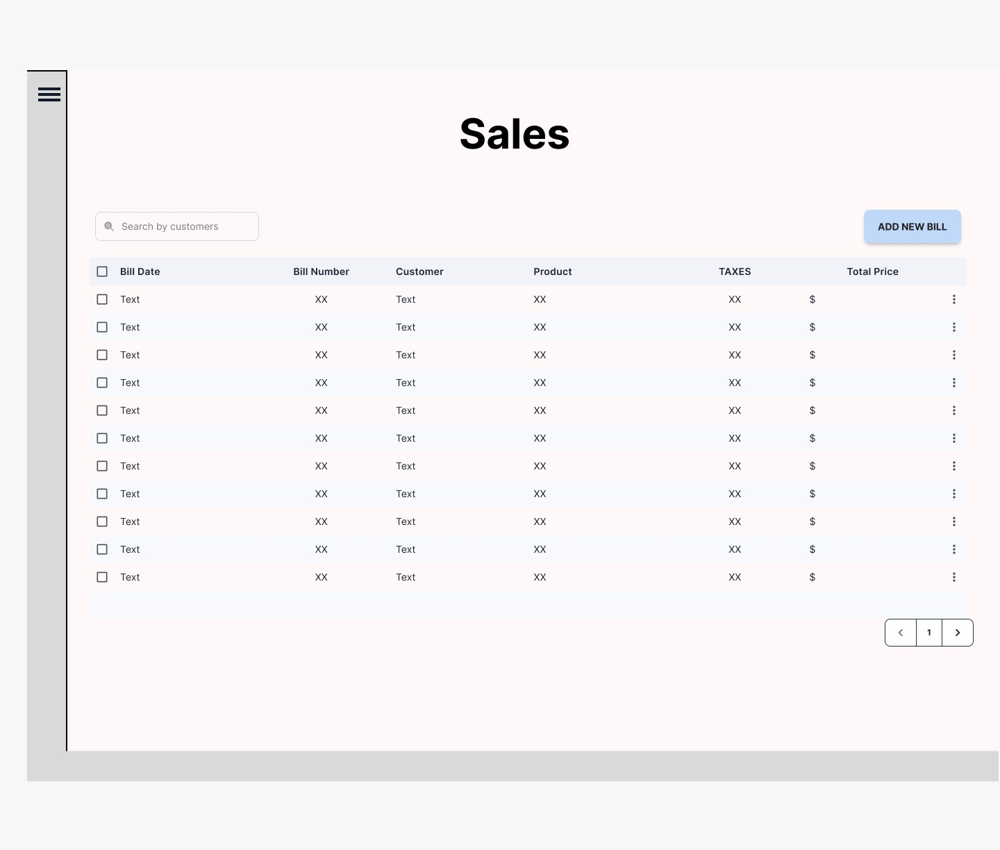
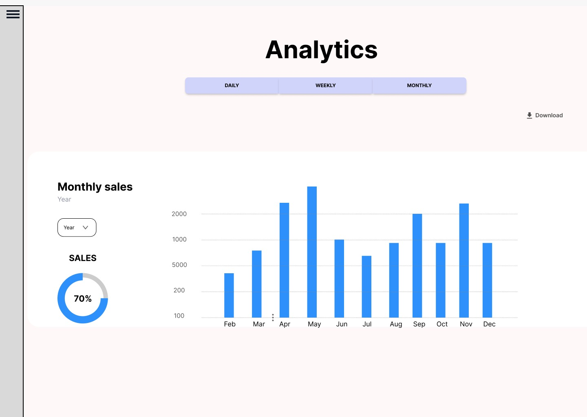

# Plataforma de inventarios y ventas para pymes
# s15-13-ft-java-react
Plataforma para el manejo de inventarios y ventas para pymes

## Industria o Rubro
Ecommerce

## Descripción
La Plataforma para el manejo de inventarios y ventas para pymes es una aplicación web diseñada para facilitar el manejo de inventarios y ventas, permite gestionar distintos tipos de inventarios de productos y generar informes de ventas e inventarios que permitiran a las pymes controlar mucho mas su negocio y tomar mejores decisiones.

#

| | |

| Crea clientes |  Crea productos  |

| | |

| Registra compras |  Registra proveedores  |

 ||

| Realiza ventas |  

#

## Saca una estadística de tu negocio

## Colaboradores

- **Rosario** - Designer UX UI
  [LinkedIn]()
- **Mariano** - QA
  [LinkedIn]()

- **Rosario Belén** - Designer UX UI
  [LinkedIn](https://www.linkedin.com/in/rosariobelen/)

- **Miguel Nesterovsky** - QA
  [LinkedIn](https://www.linkedin.com/in/miguel-angel-nesterovsky-a-18985b237/)
- **Marcos Travaglini**  - Frontend
  [LinkedIn](https://www.linkedin.com/in/marcos-travaglini/)
- **Rogelio Olarte**  - Frontend
  [LinkedIn](https://www.linkedin.com/in/rogelio-olarte)
- **Jeison Fonseca**  - Backend
  [LinkedIn](https://www.linkedin.com/in/jeisonfonseca/)
- **Lionel Staricoff**  - Backend
  [LinkedIn](https://www.linkedin.com/in/lionel-staricoff/)
- **David Sandoval**  - Backend
  [LinkedIn]()

## Tecnologías
- React
- Spring boot
- Mysql
- Figma
- Java
- Javascript

## Enlaces del Proyecto
- Repositorio en GitHub: [Enlace](https://github.com/No-Country/s15-13-ft-java-react)
